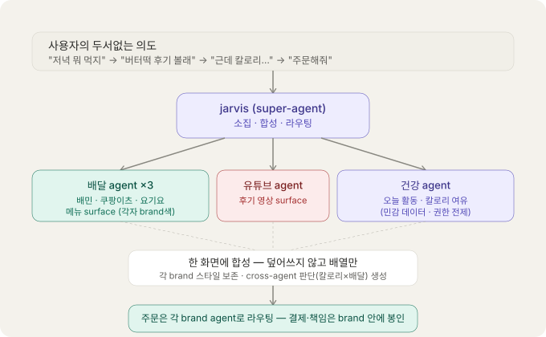
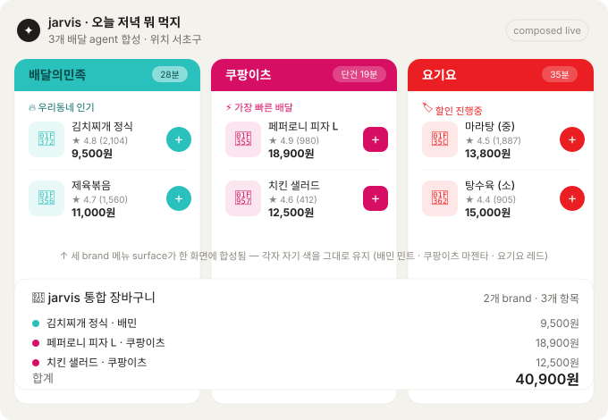
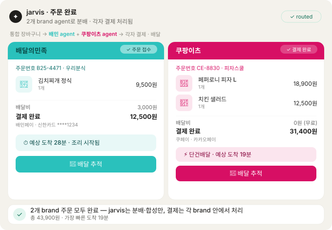
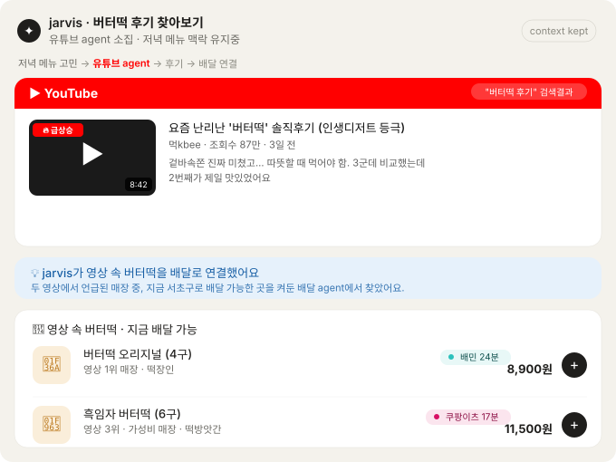
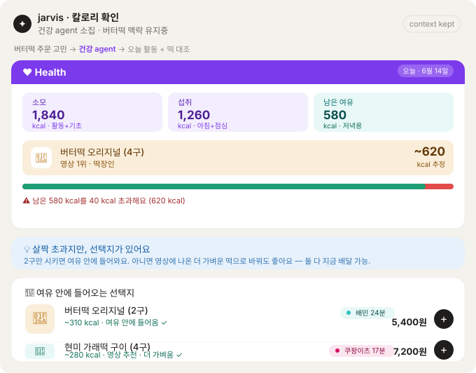

# Deciding One Meal: A Generative-UI Case Study

> A walkthrough of a single, ordinary evening — *"what should I eat tonight?"* —
> rendered as the agent-OS would render it. Five composed screens, each generated
> in the moment from multiple brands' agents, none of them a pre-built app screen.
> The point of the case study is to show, concretely, what
> *compose-don't-overwrite* looks like when a person's thoughts wander the way they
> actually do.
>
> Companion to *The Future of Software: Hyperpersonalization & the Agents
> Marketplace*. Where that document argues the thesis, this one shows it in
> pixels.

---

## The premise

The user has registered three Korean delivery agents — Baemin, Coupang Eats,
Yogiyo — plus, ambiently, a YouTube agent and a health agent. There is no "delivery
app" to open. There is a super-agent (call it jarvis) that summons surfaces from
these agents and composes them into one space as the conversation moves.

What makes this worth drawing is that real food decisions are not linear. They
wander: *what should I eat → oh, I saw a thing on YouTube → wait, calories → fine,
order it.* In the app era, each of those turns meant switching apps and losing
context. Here, the context is carried the whole way, and every screen is composed
fresh.

The whole flow, at a glance:

The super-agent's job, throughout, is the same three verbs: **summon** the right
agents, **compose** their surfaces into one screen without repainting them, and
**route** any order back to the brand that owns it. It never processes a payment
and never restyles a brand. It arranges, and it bridges.

---

## Screen 1 — "what should I eat tonight?"

The user asks an open question. jarvis summons all three delivery agents at once
and lays their menu surfaces side by side, then composes a single unified cart
underneath.

What this screen demonstrates:

- **Composition.** Three agents' menu surfaces sit in one view. What would have
  been three separate apps to open is one screen the agent assembled.
- **Compose, don't overwrite.** Baemin keeps its mint, Coupang Eats its magenta,
  Yogiyo its red — including button shapes (Baemin's round, Coupang Eats' squared).
  jarvis did not unify them into one theme. It chose the layout; each brand kept
  its identity.
- **A composed object that no single brand could make.** The unified cart at the
  bottom mixes items from two brands, color-tagged by origin. No single delivery
  app can show "items from Baemin *and* Coupang Eats in one cart" — only the agent,
  sitting above all three, can compose it.

---

## Screen 2 — "order these"

The user confirms. jarvis splits the unified cart by owning brand and routes each
part to that brand's agent. Each brand processes its own payment and returns its
own confirmation surface; jarvis composes both back into one view.

What this screen demonstrates:

- **Routing, not processing.** The cart is split — Kimchi stew to Baemin, pizza
  and salad to Coupang Eats. jarvis distributes; it does not charge anyone.
- **Payment stays inside each brand.** Baemin settles with Baemin Pay (Shinhan
  card); Coupang Eats with Coupay (Kakao Pay). Two different payment methods, two
  different responsible parties. The super-agent is a switchboard, not a bank — it
  never sees inside either checkout.
- **Confirmations are brand-native too.** Each confirmation keeps its brand color
  and its own order-number scheme (B25-4471 vs CE-8830). jarvis composes them but
  doesn't restyle them.
- **The one thing the agent adds.** The summary line — "fastest arrival 19 min"
  across both orders — is a fact no single brand could state, because neither knows
  about the other. Composing across brands is the super-agent's only added value;
  everything else is sealed in the brands.

---

## Screen 3 — "actually, let me check the butter tteok reviews"

Mid-decision, the user's mind jumps to YouTube. jarvis summons a YouTube agent
**while keeping the food context** — and, critically, bridges the reviewed shops
back to the delivery agents that are already on.

What this screen demonstrates:

- **Context carried across a jump.** The user veered from ordering to watching, but
  jarvis kept "butter tteok" as the live context. No re-typing into a separate
  YouTube app, no losing the thread.
- **YouTube looks like YouTube.** Red header, thumbnails, play buttons, view
  counts — the platform's own surface, preserved. Again, no override.
- **The bridge no single agent could build.** The blue callout is the heart of it:
  jarvis took the shops *mentioned in the videos* and queried the on delivery
  agents for "deliverable to Seocho-gu right now." The result maps the video's #1
  shop to Baemin (24 min) and its #3 budget pick to Coupang Eats (17 min). The
  YouTube agent doesn't know delivery availability; the delivery agents don't know
  what ranked #1 in a video. *Watch → compare → order* only exists because the
  agent bridged two agents' outputs.

---

## Screen 4 — "wait, calories"

Another jump. About to order, the user worries about calories. jarvis summons a
health agent, pulls today's activity and remaining budget, weighs *that same
butter tteok* against it, and composes a verdict plus lighter delivery
alternatives.

What this screen demonstrates:

- **A cross-agent judgment.** The screen answers "can I eat this?" — which requires
  overlaying two agents' data. Health knows the remaining budget (1,840 burned −
  1,260 eaten = 580 left); the delivery surface knows the item (the video's #1
  butter tteok). jarvis composes them: ~620 kcal against 580 left → 40 kcal over.
  Neither agent could reach that verdict alone.
- **Sensitive data, with a boundary.** Calorie and activity figures are health
  data. Composing them into a food decision presumes the user's permission for that
  data to flow — the boundary that gets heavier the more sensitive the domain.
- **The constraint flows back to delivery.** "Over budget" isn't the end. jarvis
  re-queried the delivery agents for solutions: a 2-piece order (310 kcal, Baemin)
  and a lighter brown-rice tteok the video recommended (280 kcal, Coupang Eats).
  The health constraint becomes delivery options — and even carries the "video
  recommended" context from Screen 3.
- **The choice stays with the user.** The buttons offer both "just eat all 4" and
  "order 2 instead." A good agent composes the information and shows it, but leaves
  the decision to the person. It informs; it does not coerce.

---

## What the five screens prove together

Read in sequence, the screens trace how a person actually decides a meal — not a
clean funnel but a wander: open question → order → sidetrack to reviews → worry
about calories → decide. In the app era this path crossed three or four apps and
broke context at every boundary. Here it is one continuous space, and every screen
is generated in the moment.

The same three verbs hold across all of them:

- **Summon** — the right agents are pulled in as the context shifts (delivery, then
  YouTube, then health), without the user managing apps.
- **Compose — don't overwrite** — every brand keeps its own color, layout, and
  identity. Baemin stays Baemin, YouTube stays YouTube, the health surface stays
  the health surface. The agent arranges; it never repaints. This is the design
  stance and the guard against an aesthetic filter bubble.
- **Route** — orders go back to the owning brand, where payment and responsibility
  stay sealed. The super-agent is the switchboard above the brands, never a bank
  inside them.

And the throughline is the one thing only a super-agent can do: **compose across
agents.** A unified two-brand cart, a "fastest of both" summary, a video-review-to-
delivery bridge, a calories-versus-menu verdict — none of these exist inside any
single brand's app. They exist only above the brands, in the moment, generated to
fit a wandering human thought. That is what generative UI is *for*.
